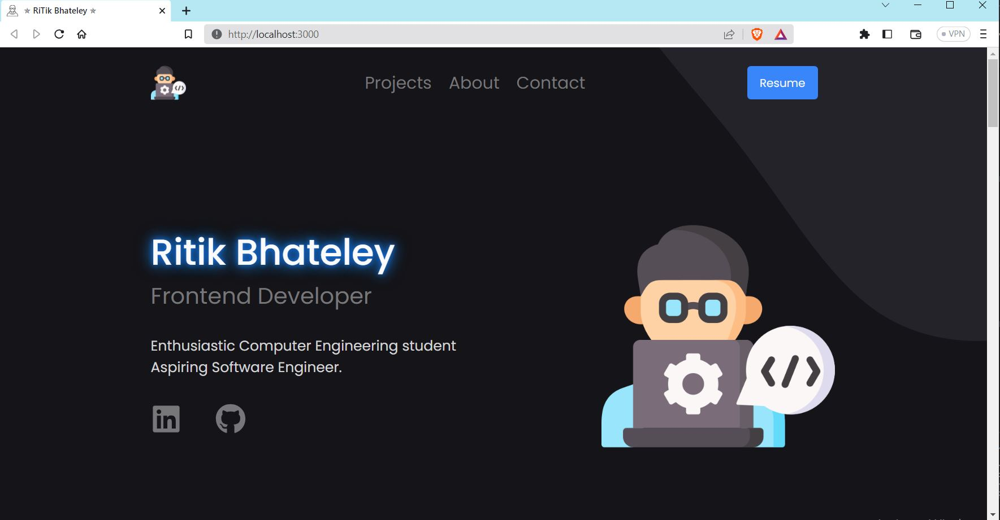

# Personal Portfolio 👨‍💻

Welcome to my personal portfolio project! This website is designed to showcase my skills, experiences, and projects, serving as a professional introduction to potential employers, clients, and collaborators.

### Website Preview

 
  <kbd>
    
  </kbd>

## Features 🌟

- Provides an overview of my background, education, and professional experience, giving visitors insights into my skills and expertise.

- Highlights a selection of my projects, including detailed descriptions, tech stack used, and links to GitHub repositories and live demos. It allows visitors to explore my work and assess my technical capabilities.

- Interactive Design: Utilizes modern UI/UX principles and responsive design to create an engaging and visually appealing user experience across various devices and screen sizes.

-  Includes links to my social media profiles, such as LinkedIn and GitHub, allowing visitors to connect with me for networking, collaboration opportunities, and access to additional resources.

- Implemented a modular component-based architecture to ensure maintainability and scalability.
- Utilized styled components and CSS to create an aesthetically pleasing and responsive user interface.
- Integrated React Icons library to add social media links and enhance the user experience.
- Showcased projects through project cards, providing project details, including tech stack, GitHub links, and live demos.
-  Fully Responsive

## Sections 📚
✔️ About me\
✔️ Experience\
✔️ Projects \
✔️ Skills \
✔️ Education\
✔️ Contact Info\
✔️ Resume

## Technologies Used 🛠️

- **React**: Built with React, a popular JavaScript library for building user interfaces, enabling efficient component-based development and seamless state management.

- **Styled Components**: Utilizes Styled Components, a CSS-in-JS library, for styling React components. It allows for easy and modular styling, enhancing maintainability and reusability.

- **React Icons**: Integrates React Icons library to easily include popular icons in the project, enhancing visual aesthetics and providing intuitive visual cues.

- **React Router**: Incorporates React Router library for handling navigation and routing in a single-page application. It enables smooth transitions between different sections of the portfolio.
  
-  [<b>GitHub Pages</b>](https://create-react-app.dev/docs/deployment/#github-pages) - To host my static website (HTML, CSS, JS).
